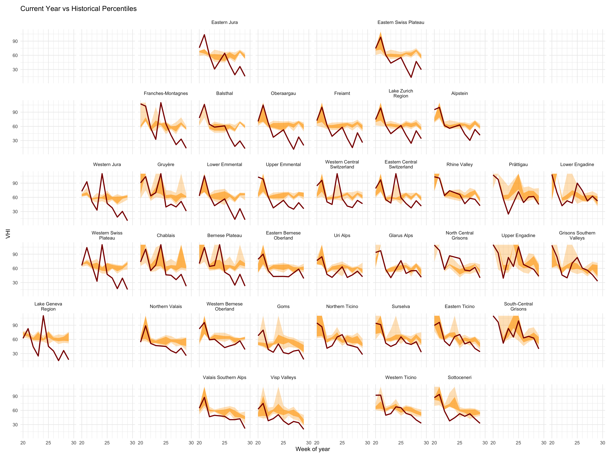

# vhi-monitor



## Per-Kanton VHI extraction (`extract_kantons.py`)

`extract_kantons.py` extracts VHI (Vegetation Health Index) raster statistics
per **Kanton** instead of the FOEN warnregions used by `extract_warnregions.py` of https://github.com/swisstopo/topo-satromo/ and 
`data-transform.py`.

What it does:

- Queries the `ch.swisstopo.swisseo_vhi_v100` STAC collection via
  `pystac_client` (with the `COLLECTIONS`/`ITEM_SEARCH` conformance workaround
  needed for the swisstopo STAC implementation) for items in a
  `--start-date`/`--end-date` (`YYYY-MM-DD`) range.
- For each item, locates the `forest-10m.tif` and `vegetation-10m.tif` COG
  assets and computes zonal statistics per Kanton using
  `Boundaries_G1_Canton_20260101.shp`, with `KTNR`/`KTNAME` in place of the
  warnregions' `REGION_NR`/`Name`.
- Writes **only parquet** (no CSV/GeoJSON) to `parquet_files_kt/forest/` and
  `parquet_files_kt/vegetation/`, following the existing filename convention
  but with `-kantons` instead of `-warnregions` (e.g.
  `ch.swisstopo.swisseo_vhi_v100_2024-07-01t235959_forest-kantons.parquet`),
  so they're clearly distinguishable from the warnregion files sitting
  alongside them in the repo.
- Skips any date/type combination whose output file already exists, so
  reruns only fetch newly published dates.

Usage:

```bash
python extract_kantons.py --start-date 2024-01-01 --end-date 2024-12-31 --workers 4
```

### Performance / parallelization

Each date/type combination (e.g. "forest, 2024-07-01") is fetched and
processed independently, so they're farmed out to a thread pool via
`--workers` (default `4`) instead of one at a time — most of the time per
file is spent waiting on the network, and GDAL's I/O releases the GIL, so
threads overlap well.

Benchmarked on 6 dates × 2 types (12 files, June 2023):

| Mode | Wall time | Avg / file |
|---|---|---|
| `--workers 1` (sequential) | 7m 04s | ~35s |
| `--workers 6` | 3m 10s | ~16s |

About a 2.2x speedup — not linear with worker count, since it's bandwidth/
latency bound against the swisstopo server rather than purely request-count
bound, and each file still does 26 sequential per-Kanton reads internally.
Going beyond `--workers 4-6` gave diminishing returns in testing and is
less polite to the remote server, so that's the recommended range.

One thing that was tried and **didn't** help: downloading the whole raster
once per file and masking all 26 Kantons in memory (instead of one windowed
network read per Kanton). This was expected to cut network round-trips, but
benchmarked slower (~26s vs ~18s per file) — the union of all Kanton
bounding boxes already covers ~80% of the raster's pixel area (the COG
canvas is tightly cropped to Switzerland), so a full download wastes
bandwidth on padding that GDAL's per-polygon windowed reads (with block
caching reused across the loop) already skip.

### Kanton boundaries data source

`Boundaries_G1_Canton_20260101.shp` is the Kanton boundary layer ("mittlere
Genauigkeit" / medium accuracy) downloaded from the BFS boundaries service:
https://www.agvchapp.bfs.admin.ch/de/boundaries?SnapshotDate=01.01.2026&Unit=Cantons

Missing/invalid raster edge cases (e.g. tiny cantons like Appenzell
Innerrhoden with no valid pixels for a given date) fall back to a sentinel
value (110 / 110.0), inherited unchanged from the original
`extract_warnregions.py` logic.
